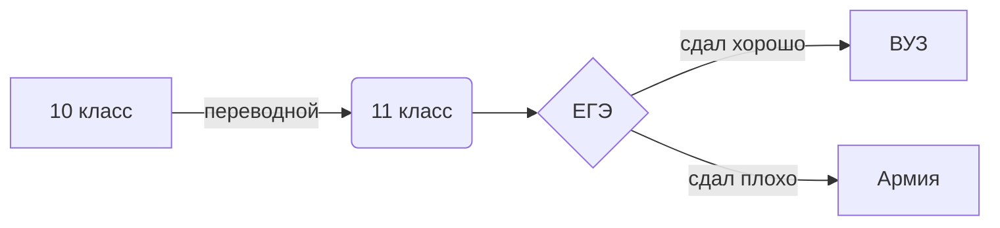

# Геннадий Сухорослов Пинжина Полина
SELECT * FROM users (вывести из все из таблицы с пользователями)

SELECT * FROM users WHERE name='Олег' (найти записи с именем олег)

SELECT * from grades (вывести все оценки)

SELECT * FROM users JOIN grades on users.user_id=grades.user_id (вывести пользователей и их оценки)

SELECT  COUNT(*) FROM information_schema.tables WHERE table_schema = 'p518238_lyc' (Сколько таблиц в базе данных)

SELECT COUNT(*) FROM users (сколько чловек в таблице)

sibirtsevgennadijgmail.wordpress.com

python шпора.ipynb (базовая конструкция pyton)

bdtest.py (база данных)

$$ W_c={\frac{C U^{2}}{2}} $$

$$ V=\sqrt{\frac{GM}{R}} $$

$$ E=mc^{2} $$

https://deepnote.com/@gena-sukhoroslov

